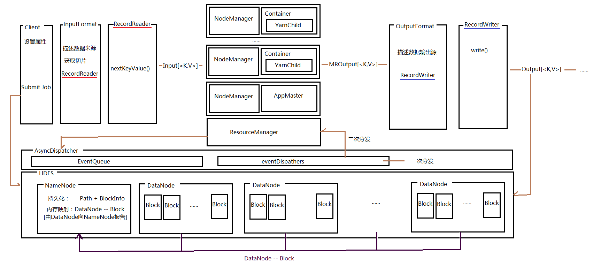

## Hadoop
**说在前面的话**

    学习Hadoop之后，根据个人理解，给出Hadoop中比较重要的组件，及其之间的关联，若有理解不到位之处，后续改正。

***
### Hadoop整体预览

### 重要组件及重要过程
1.**HDFS**
```
1. HDFS : Hadoop Distributed File System
2. HDFS用于Hadoop的分布式存储，可以查看[相关概念以及常用命令](https://github.com/sqdmydxf/Hadoop-Ecosystem/blob/master/Hadoop/Docs/Hdfs.md)
```
2.**YARN架构**

3.**本地模式MR过程分析**
```
对于Map 和 Reduce过程，一开始先从本地模式开始，用调试的方法跑通整个过程
查看[Map和Reduce运行流程](https://github.com/sqdmydxf/Hadoop-Ecosystem/blob/master/Hadoop/Docs/LocalMapReduce.md)
```
4.**分布式下作业提交过程**
```
跑通本地模式下的MR过程，接下来就是分布式环境了，因为分布式涉及到远程调试，因而先从提交作业的过程开始分析
查看[分布式环境下作业提交的过程](https://github.com/sqdmydxf/Hadoop-Ecosystem/blob/master/Hadoop/Docs/YarnSubmitJob.md)
```
5.**二次分发过程**
```
作业提交到分布式环境中，会转换成应用(Application)，Hadoop对应用的处理是基于事件的，会将应用状态转换的每一步当做一个事件存于底层的
事件队列中进行处理，而对事件的处理会经过一个二次分发的过程
查看[事件二次分发过程](https://github.com/sqdmydxf/Hadoop-Ecosystem/blob/master/Hadoop/Docs/RMDispatchAndAppState.md)
```
6.**InputFormat & OutputFormat**
```
Hadoop处理的是海量的数据，而数据的来源可以来自文本，数据库或其他，对于这些数据来源的描述、处理就需要使用InputFormat
Map过程处理的是key-value键值对，而从数据源到键值对的转换即需要RecordReader
相应的，对于MR结果的输出则是OutputFormat及RecordWriter
查看[InputFormat & OutputFormat过程](https://github.com/sqdmydxf/Hadoop-Ecosystem/blob/master/Hadoop/Docs/(Input-Output)Format.md)
```
7.**HA**
```
Hadoop存在单点故障的问题，对于这些问题的处理就需要用到HA高可用技术
查看[HA设置](https://github.com/sqdmydxf/Hadoop-Ecosystem/blob/master/Hadoop/Docs/HA.md)
```