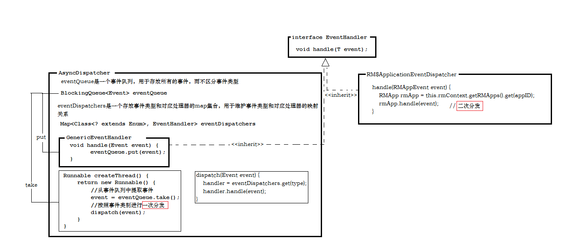

##完全分布式集群下Resourcemanager二次分发以及作业提交到集群后状态的变化
**说在前面的话**

	最近在自学Hadoop，通过远程调试，查看Hadoop中完全分布式下Resourcemanager二次分发以及作业提交到集群后状态的变化。

	IDE：eclipse

	调试IDE所在操作系统：win10

	Hadoop集群操作系统：Ubuntu16.04

	Hadoop集群环境：完全分布式模式
***
1.**远程调试单一进程[e.g. resourcemanager]**
```
服务器端：
	1. 在集群上关闭resourcemanger进程
	2. 设置环境变量：export YARN_RESOURCEMANAGER_OPTS="-agentlib:jdwp=transport=dt_socket,server=y,suspend=y,address=8000"
	3. 开启resourcemanger进程
	4. 开始监听
eclipse客户端：
	1. 在resourcemanager程序中打断点
	2. 在debug configuration选项中新建remote java application
	3. 设置所属项目，远程ip，远程监听的端口[即服务端设置的8000端口]
	4. 点击debug，进行调试
```
2.**两个概念**
```
IPC : 进程间通信
RPC : 远程过程调用
```
3.**EventHandler**
```
EventHandler<T extends Event>		// 用于处理和它关联的事件Event
Event<TYPE extends Enum<TYPE>>		// 每个事件Event都有与其关联的类型TYPE
TYPE								// 事件类型TYPE，即事件拥有的各种状态，即事件生命周期中的各个过程，用于状态机对其状态的转换
```
4.**RM二次分发图解**

5.**二次分发调试解析**

``ResourceManager``
```
--> ResourceManager.main()										// ResourceManager入口main函数
	--> new YarnConfiguration()									// 设置YarnConfiguration，即core-default.xml, core-site.xml, yarn-default.xml, yarn-site.xml
	--> resourceManager.init(conf)								// 初始化resourceManager
		--> AbstractService.init()								// 调用父类AbstractService的初始化init方法
			--> ResourceManager.serviceInit(config)				// 调用ResourceManager自身的serviceInit方法，即回调过程
				--> conf.addResource(coreSiteXMLInputStream)	// 加载core-site.xml
				--> conf.addResource(yarnSiteXMLInputStream)	// 加载yarn-site.xml
				--> rmContext.setHAEnabled(...)					// 设置HA
				-->	setupDispatcher()							// 设置分发器，register the handlers for all AlwaysOn services
					--> createDispatcher()						// 创建分发器
						--> new AsyncDispatcher()				// 用构造新建分发器
				--> addService(adminService)					// 为服务注册处理器，即把映射关系放入AsyncDispatcher.eventDispatchers集合中
				--> add...										// 为其他常在服务注册处理器
```
``AsyncDispatcher``
```
--> serviceStart()												// 用于在事件状态由INITED向STARTED转换时调用，即事件初始化完成，启动事件时调用
	--> createThread()											// 创建提取分发线程
		--> eventQueue.take()									// 从事件队列中提取事件
		--> dispatch(event)										// 按照事件类型*一次分发*事件
			--> event.getType().getDeclaringClass()				// 获取事件类型
			--> eventDispatchers.get(type)						// 根据类型获取相应的处理器
			--> handler.handle(event)							// 调用处理器的handle方法进行处理
				--> rmContext.getRMApps().get(appID)			// 通过appID获取RMApp
				--> rmApp.handle(event)							// 调用RMApp的handle方法进行处理，即*二次分发*
```
6.**job提交到集群之后的状态变换**
```
在集群上提交一个job，断点停在ResourceManager$ApplicationEventDispatcher.handle方法
--> handle(RMAppEvent event)									// EventType: START || UI State: NEW
	--> event.getApplicationId()								// ApplicationId: application_1489305385892_0001
	--> rmContext.getRMApps().get(appID)						// 获取RMApp: org.apache.hadoop.yarn.server.resourcemanager.rmapp.RMAppImpl@252ec2a1
																// Dispatcher: STARTED
	--> RMAppImpl.handle(event)									// 交由RMAppImpl处理，即二次分发
		--> RMAppState oldState = getState()					// 获取之前一次状态: NEW
		--> stateMachine.doTransition(event.getType(), event)	// 状态机进行状态变换
--> // 事件转换状态之后，仍会被放到eventQueue队列中等待处理
--> AsyncDispatcher$GenericEventHandler.handle(Event event)

--> handle(RMAppEvent event)									// EventType: APP_NEW_SAVED 		|| UI State: NEW_SAVING
	--> ...[重复以上过程]

--> handle(RMAppEvent event)									// EventType: APP_ACCEPTED 			|| UI State: SUBMITTED
	--> ...

--> ApplicationAttemptEventDispatcher.handle(RMAppEvent event)	// EventType: NEW 					|| UI State: ACCEPTED
	--> ...

--> ApplicationAttemptEventDispatcherhandle(RMAppEvent event)	// EventType: START 				|| UI State: ACCEPTED
	--> ...

--> ApplicationAttemptEventDispatcherhandle(RMAppEvent event)	// EventType: ATTEMPT_ADDED 		|| UI State: ACCEPTED
	--> ...

--> ApplicationAttemptEventDispatcherhandle(RMAppEvent event)	// EventType: CONTAINER_ALLOCATED 	|| UI State: ACCEPTED
	--> ...

--> handle(RMAppEvent event)									// EventType: APP_RUNNING_ON_NODE 	|| UI State: ACCEPTED
	--> // 更新进度

--> ApplicationAttemptEventDispatcherhandle(RMAppEvent event)	// EventType: ATTEMPT_NEW_SAVED 	|| UI State: ACCEPTED
	--> ...

--> ApplicationAttemptEventDispatcherhandle(RMAppEvent event)	// EventType: LAUNCHED 				|| UI State: ACCEPTED
	--> ...

--> ApplicationAttemptEventDispatcherhandle(RMAppEvent event)	// EventType: REGISTERED 			|| UI State: ACCEPTED
	--> ...

--> ApplicationAttemptEventDispatcherhandle(RMAppEvent event)	// EventType: STATUS_UPDATE 		|| UI State: ACCEPTED [尝试多次]
	--> ...

--> handle(RMAppEvent event)									// EventType: APP_RUNNING_ON_NODE 	|| UI State: RUNNING
	--> // 更新进度

--> ApplicationAttemptEventDispatcherhandle(RMAppEvent event)	// EventType: STATUS_UPDATE 		|| UI State: RUNNING [尝试多次]
	--> ...

--> handle(RMAppEvent event)									// EventType: APP_RUNNING_ON_NODE 	|| UI State: RUNNING
	--> // 更新进度

--> handle(RMAppEvent event)									// EventType: ATTEMPT_UNREGISTERED 	|| UI State: RUNNING
	--> // 更新进度

--> handle(RMAppEvent event)									// EventType: APP_UPDATE_SAVED 		|| UI State: RUNNING 	|| FinalStatus: SUCCEEDED
	--> // 更新进度

--> FINISHED

--> // 其中可能会出现一些问题，而导致进入ResourceManager$ApplicationAttemptEventDispatcher.handle方法中进行尝试，尝试的过程中，UI界面就是ACCEPTED状态。
--> // 从ApplicationEventDispatcher分发器可以看出Application在集群上的状态变换： START -> APP_NEW_SAVED -> APP_ACCEPTED -> APP_RUNNING_ON_NODE[多次处于该状态] -> ATTEMPT_UNREGISTERED -> APP_UPDATE_SAVED
--> // webUI中显示出的Application状态变换：NEW -> NEW_SAVING -> SUBMITTED -> ACCEPTED -> RUNNING -> FINISHED
```